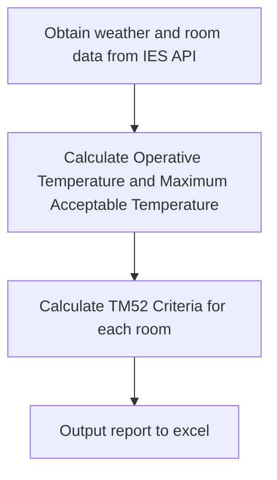

# TM52 Calculation

## Code

The process of how the script obtains the report:

## Mathematics
### Calculate The Operative Temperature
Calculate operative temperature for each room that we want to analyse.
It'll do this for each air speed. 

$$
    T_{op} = \frac{T_{a}\sqrt{10v} + T_{r}}{1 + \sqrt{10v}}
$$

where $T_{op}$ is the operative room temperature ($^\circ C$),

$T_{a}$ is the indoor air temperature $(^\circ C)$,

$T_{r}$ is the mean radiant temperature $(^\circ C)$,

and $v$ is the summer (elevated) air speed $(ms^{-1})$.

*Reference: See CIBSE Guide A, Equation 1.2, Part 1.2.2*
### Calculate The Daily Running Mean Temperature
We calculate the daily running mean temperature using the following equation:

$$
T_{rm} = (1 - \alpha) T_{od-1} + \alpha T_{rm-1} 
$$

where $T_{rm} is the daily running mean temperature for that day,

$T_{od-1}$ is the daily mean dry-bulb temperatures for yesterday,

$T_{rm-1}$ is the daily running mean temperatures for yesterday

and $\alpha$ is a constant $( \alpha < 1 )$.

*Reference: See CIBSE TM52: 2013, Page 7, Equation 2.2, Box 2*

If an extensive run of days is not available then calculate an approximate starting mean temperature from the last seven days. *Refererence: BS EN 15251 (BSI, 2007)*

The start-off value is calcuated with $\alpha = 0.8$:

$$
T_{rm} = \frac{T_{od-1} + 0.8 T_{od-2} + 0.6 T_{od-3} + 0.5 T_{od-4} + 0.4 T_{od-5} + 0.3 T_{od-6} + 0.2 T_{od-7}}{3.8}
$$

*Reference: See CIBSE TM52: 2013, Page 7, Equation 2.3, Box 2*

### Calculate The Maximum Acceptable Temperature
We firstly calculate the comfort temperature using the following equation:

$$
T_{comf} = 0.33 T_{rm} + 18.8
$$

where T_{comfort} is the comfort temperature,
and T_{rm} is the daily running mean temperature.

*Reference: See CIBSE TM52: 2013, Page 10, Equation 6, Section 4.1.4*

We then calculate the maximum acceptable temperature:

$$
T_{max} = T_{comf} + T_{cat} + \Delta T_{v}
$$

where $T_{max}$ is the maximum acceptable temperature,

$T_{comf}$ is the comfort temperature,

$T_{cat}$ is the temperature depending on the building category (for TM52 this is Category II),

and $\Delta T_{v}$ is the additional cooling applied depending on the the elevated air speed.

*Reference: See CIBSE TM52: 2013, Page 13, Equation 8, Section 6.1.2*

Note that the CIBSE guidance doesn't add the $\Delta T_{v}$ explicitely into the equation.

Building category table we use for $T_{cat}$:

|   Category   |                                          Explanation                                          | Suggested Acceptable Range (K) |
| :----------: | :-------------------------------------------------------------------------------------------: | :----------------------------: |
|  Category I  | High level of expectation only used for spaces occupied by very sensitive and fragile persons |               2                |
| Category II  |                    Normal expectation (for new buildings and renovations)                     |               3                |
| Category III |                     A moderate expectation (used for existing buildings)                      |               4                |

For $\Delta T_{v}$, we use the following equation:

$$
\Delta T_{v} = 7 - \frac{50}{4+10 \sqrt{v}}
$$

*Reference: See CIBSE TM52: 2013, Page 5, Equation 1, Section 3.2.2*

### Calculate Delta T
Calculates changes in temperature for each room between the operative temperature and the maximum acceptable temperature. 

*Reference: See CIBSE TM52: 2013, Page 13, Equation 9, Section 6.1.2*

### Run through the TM52 criteria
1. Criterion one 
   
    No room can have delta T equal or excede the threshold (1 kelvin) during occupied hours for more than 3 percent of the 
    total occupied hours. 
    
    *Reference: See CIBSE TM52: 2013, Page 13, Section 6.1.2a*

2. Criterion two
   
    No room can have a daily weight greater than the threshold (6) where the daily weight is calculated from the reporting intervals
    within occupied hours. 
    
    *Reference: See CIBSE TM52: 2013, Page 14, Section 6.1.2b*

3. Criterion three 
   
    No room, at any point, can have a reading where delta T excedes the threshold $(4K)$. 
    
    *Reference: See CIBSE TM52: 2013, Page 14, Section 6.1.2c*
